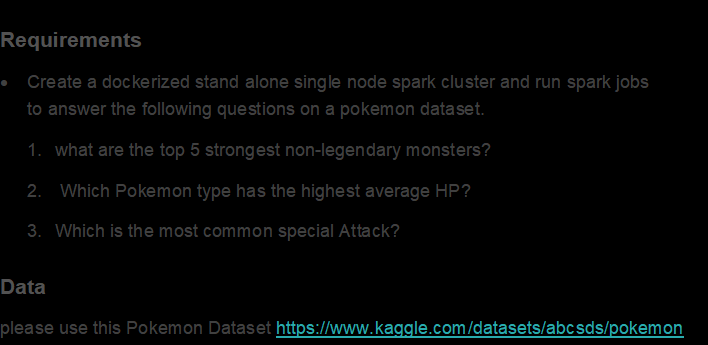
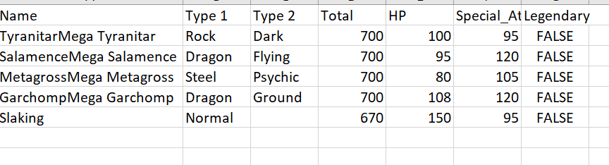
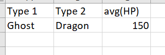
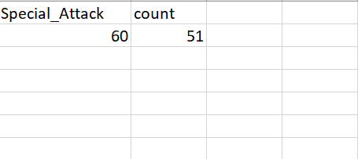

# Take-home challenge: Pokemon

This repo holds code for the takehome challenge using py-spark
which answers the following questions



## Run locally

Steps to run locally 
1. Replace the username and key in kaggle.json
2. place the spark-3.2.0-bin-hadoop3.2.tgz file in the same directory as your Dockerfile <br>
   https://archive.apache.org/dist/spark/spark-3.2.0/
2. create a spark image by running the below cmd in cmdline <br>
```docker build -t spark-image .```
3. Run spark jobs <br>
```docker run -it -v <local output folder>:/root/pokemon/output/ spark-image spark-submit /root/pokemon/takehomechallenge.py```

The output is
1.	What are the top 5 strongest non-legendary monsters? <br>
 <br>
 the output file is found in output/top_5_strongest_pokemon/part**.csv 
2.  Which Pokemon type has the highest average HP? <br>
     <br>
the output file is found in output/highest_avg_hp_combined/part**.csv
3.  Which is the most common special Attack <br>
    <br>

the output file is found in output/most_common_special_attack.csv/part**.csv
